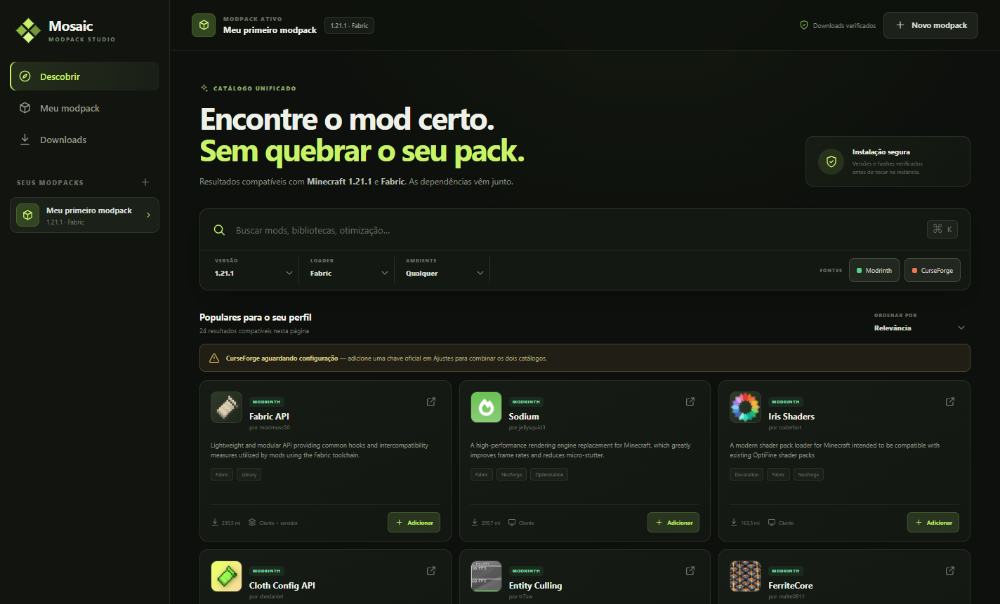

# Mosaic Modpack Studio

[](https://github.com/lucasRCFM3/mosaic-modpack-studio/actions/workflows/ci.yml)

Aplicativo desktop local-first, construído com **Rust + Tauri 2 + React**, para pesquisar, resolver e instalar mods compatíveis da Modrinth e, mediante chave oficial, da CurseForge.



## O que funciona

- busca unificada e paralela nos dois catálogos;
- filtros por versão do Minecraft, loader, ambiente, origem e ordenação;
- resolução recursiva do grafo de dependências no backend Rust;
- dependências obrigatórias instaladas automaticamente;
- dependências opcionais exibidas para escolha e desmarcadas por padrão;
- detecção de ciclos, incompatibilidades, versões ausentes e distribuição bloqueada;
- revisão do plano antes de qualquer escrita em disco;
- downloads concorrentes por HTTPS, arquivo `.part`, verificação de hash e renomeação;
- perfis independentes, registro dos mods e lockfile JSON exportável;
- chave da CurseForge guardada no cofre de credenciais do sistema operacional;
- frontend sem acesso direto ao sistema de arquivos ou aos segredos;
- instalador NSIS nativo para Windows.

## Dependências automáticas

| Tipo informado pelo catálogo | Comportamento |
| --- | --- |
| Obrigatória (`required`) | Incluída automaticamente no plano |
| Opcional (`optional`) | Exibida desmarcada; o usuário escolhe individualmente |
| Embutida (`embedded`) | Não é baixada separadamente |
| Incompatível (`incompatible`) | Bloqueia o plano quando o conflito está presente |

Existe uma preferência para pré-selecionar opcionais, mas ela é **opt-in** e vem desativada em instalações novas.

## Desenvolvimento

Requisitos no Windows:

- Node.js 22 ou mais recente;
- Rust stable com o alvo `x86_64-pc-windows-msvc`;
- Microsoft C++ Build Tools;
- Microsoft Edge WebView2 Runtime.

```powershell
npm install
npm run dev
```

## Validar e empacotar

```powershell
npm run check
npm run package
```

O instalador é criado em `src-tauri/target/release/bundle/nsis/`.

## Arquitetura

```text
src/
  renderer/                 interface React e ponte tipada para os comandos Tauri
  shared/                   contratos usados pelo frontend
src-tauri/src/
  application/             catálogo, perfis, resolução e downloads
  infrastructure/          persistência JSON e cofre de credenciais
  providers/               adaptadores Modrinth e CurseForge
  commands.rs              fronteira Tauri e validação de entrada
  domain.rs                modelo de domínio independente das APIs
  state.rs                 composição da aplicação
```

As decisões técnicas e os limites dos módulos estão em [docs/ARCHITECTURE.md](docs/ARCHITECTURE.md).

Para contribuir, consulte [CONTRIBUTING.md](CONTRIBUTING.md). Questões de segurança devem seguir [SECURITY.md](SECURITY.md), e o tratamento de dados está descrito em [PRIVACY.md](PRIVACY.md).

## CurseForge: requisito importante

A integração fica desabilitada até o usuário fornecer sua própria chave. A CurseForge exige solicitação e aprovação de chave, e projetos cujo autor desativou a distribuição externa podem não oferecer URL direta. O Mosaic detecta esse caso e direciona o usuário à página oficial.

- [Como solicitar uma chave](https://support.curseforge.com/support/solutions/articles/9000208346-about-the-curseforge-api-and-how-to-apply-for-a-key)
- [Termos da API de terceiros](https://support.curseforge.com/support/solutions/articles/9000207405-curseforge-3rd-party-api-terms-and-conditions)
- [Documentação da API CurseForge](https://docs.curseforge.com/rest-api/)
- [Documentação da API Modrinth](https://docs.modrinth.com/api/)

## Privacidade

Não há telemetria. Preferências e perfis ficam no diretório de dados do aplicativo, enquanto os mods ficam na pasta escolhida para cada instância. A chave da CurseForge nunca é devolvida ao frontend: a interface recebe somente o estado “configurada/não configurada”.

## Licença

Nenhuma licença de código aberto foi definida ainda. Até que uma licença seja adicionada, todos os direitos permanecem reservados ao autor.
